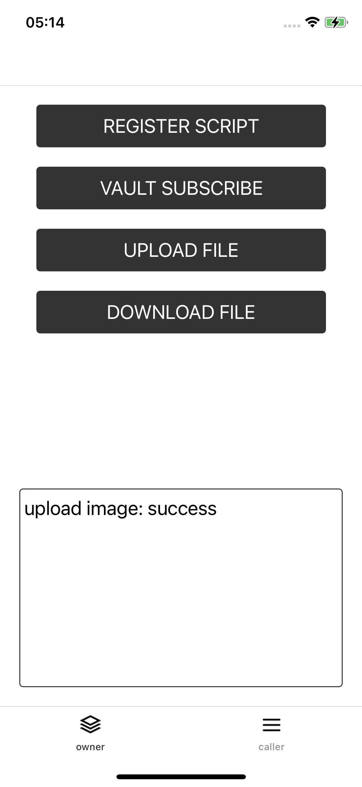

# Run App

After running the Example to the iOS simulator or real machine, the following interface appears:

More functions are contained in the actual sample application:

* Subscribe to Vault Subscription on trusted Hive Node
* Upload the file to the corresponding Vault
* Function display code related to Scripting mechanism

Users can click the **Upload File** button to upload local pictures.
